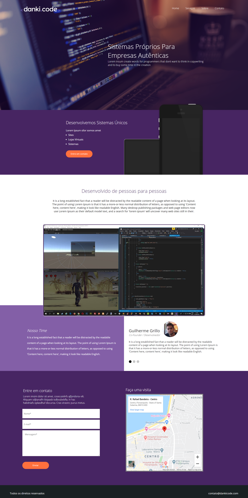

# Site Danki Code

* 4º projeto, feito em HTML, CSS e JavaScript.
* Projeto desenvolvido no curso de Front-End da Danki Code.
* Site responsivo para todos os dispositivos.
* Menu "hamburguer" para Tablet e Smartphone.
* JavaScript alterado para melhorar a experiência do usuário na parte do menu e da navegação dos integrantes da equipe.
* Google Maps implementado usando como base o site: "https://www.maps-generator.com".